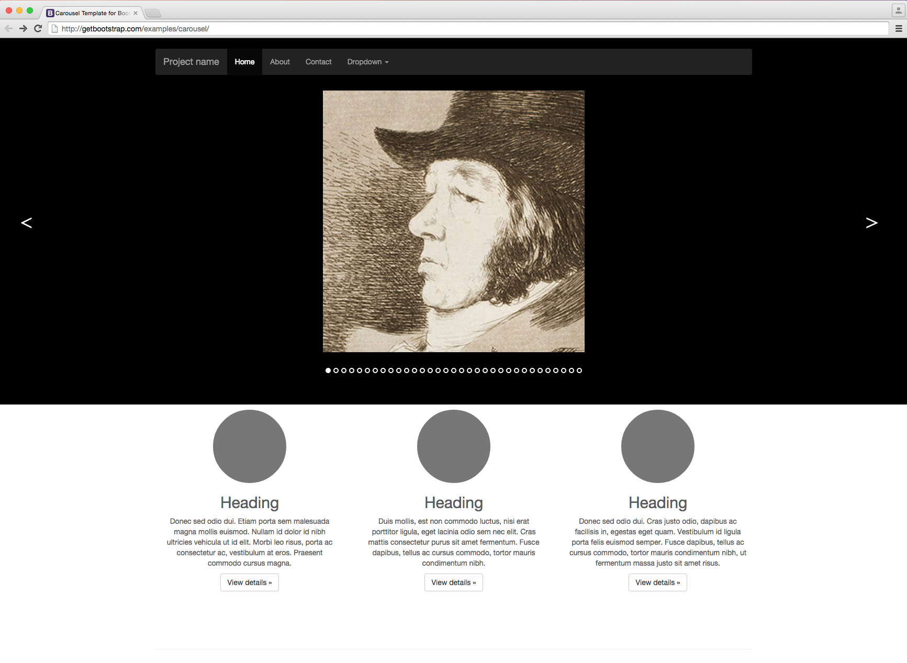

With Famous containers and widgets, upgrading an existing website with stunning UI elements has never been easier. If you know how to embed a basic image or video, then you're ready to start embedding entire Famous projects into websites.

## Install the CLI

If you haven't done so already, install the Famous CLI by typing the following command into the terminal:

    $ npm install -g famous-cli

The CLI makes creating, developing and deploying Famous projects dead simple. Let's run through the Famous CLI commands (all of these commands should be typed into the terminal and the `$` is not typed).

## Register with Famous Cloud Services

    $ famous register

Registering is free, easy, and allows you to push your seed projects to the cloud. Think YouTube meets GitHub.

### Login

    $ famous login

Follow the prompts to login to your Famous Cloud Services user account. Note that if you ran `$ famous register` you are automatically logged in.

## Create your first project

    $ famous create <seed-project-name>

Famous seed projects can be created using the `$ famous create` command. You do not need to be logged in or registered with Hub services to create and develop famous projects.

## Develop your project

    $ famous develop
    
You can develop your seed project locally using `$ famous develop`. This will install dependencies, build your project, and serve it on port 1618. Every time you save, a watch script will re-bundle your files and update when you refresh making tinkering a breeze.  

### Deploy

    $famous deploy

Once you are logged in, you can deploy your seed project to the cloud. `$ Famous deploy` builds your project and deploys it to a Hub container which is viewable by visiting the share link or embeddable using the returned HTML. 

    Share: https://api-beta.famo.us/codemanager/v1/containers/your-container's-unique-ID/share
    Embed:
    
    

Everytime you run `famous` deploy your container will update with your most recent changes. 

[Up Next: See it in action &raquo;](./seeitinaction.html)
