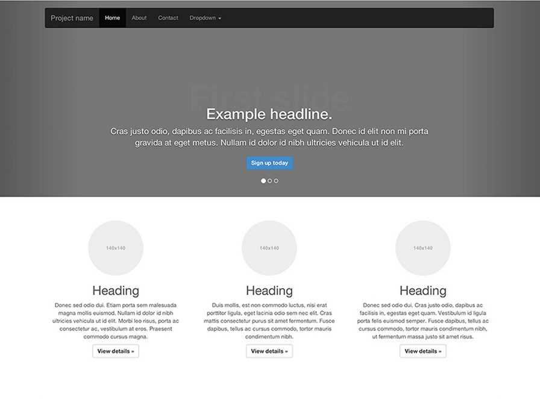

  Now that we understand the Famous CLI basics, let's see how easy it is to add a project to an existing website. For demonstration purposes, we will replace a Bootstrap carousel with the carousel we built in the [Carousel Tutorial](http://famous.org/learn/Carousel/).

## Clone the project

The following commands will install a fresh copy of the Famous Carousel to your desktop:

    $ cd ~/desktop
    $ git clone -b final git@github.com:Famous/lesson-carousel-starter-kit.git
    $ cd lesson-carousel-starter-kit

## Setup and Deploy

Next let's install the dependencies and deploy the project to the cloud.

    $ npm i
    $ famous deploy

This should return a Share link and Embed code snippet that resembles this:
    
    Share: https://api-beta.famo.us/codemanager/v1/containers/your-container's-unique-ID/share
    Embed:
    
    

Copy only the embed code before moving on to the next step.

## Downloading the Bootstrap page

Head to the Bootstrap Carousel example page at: [http://getbootstrap.com/examples/carousel/](http://getbootstrap.com/examples/carousel/) and hit _ctrl/command + S_  to save the page on your computer. Save the complete webpage so you store the assets with it. 

<b>Note:</b> Alternatively, you can also get the Bootstrap Carousel page by cloning down the Bootstrap project at: <a href="https://github.com/twbs/bootstrap">https://github.com/twbs/bootstrap</a> and navigating to <code>index.html</code> file located in the <code>docs > examples > carousel</code> directory.

## Replacing the carousel

Open the HTML file up in your favorite text editor. Delete the Bootstrap carousel by removing the `
` with the `myCarousel` class and everything in between. This should include everything between the `<!-- Carousel --> <!-- /.carousel -->` comments. 

Using the embeddable HTML code you copied in the previous step above, paste the lines into the area where the Bootstrap carousel was previously located.

## Styling the container

In order for your newly embedded container to show up on your page, you need to give it a height and width via CSS. For brevity sake, let's add some inline styles. Within the `
` tag you just pasted, give it a style attribute with a height of 500px, a width of 100% and a bottom margin of 15px so it looks like the snippet below. 

     

Now if you save and open up your HTML page in the browser, the Famous Carousel widget should be included in place of the old one. 

## Multiple containers

Containers can be used in multiple areas of the page without conflicting with each other or the page where they are embedded. You can follow the same steps above to add several containers to a page. 
Check out the link below where we have embedded our carousel multiple times into a single page. 

<iframe src="http://famous.org/learn/EmbeddingProjects/assets/CarouselTemplate.html" style="margin-top:10px;margin-botom:20px;height:500px;width:100%"></iframe>

Live (fullscreen): [Upgraded carousel example](./assets/CarouselTemplate.html)
Code (Github): [CarouselTemplate.html](https://github.com/Famous/engine-guides/blob/master/EmbeddingProjects/assets/CarouselTemplate.html) 

In our upgraded carousel example above, we replaced all of the _featurette images_ with the same `Embedded Carousel` container. Note that multiple containers can share a single  `<script>` tag when embedded on the same page.
