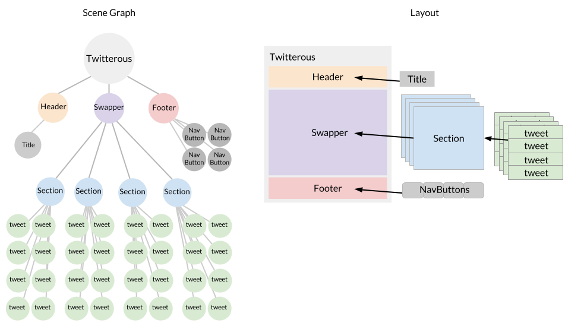

Now that we have the foundation of our app in `Twitterus.js`, let's get an idea of what we are building before we start coding. Here, we will break down our app and familiarize you with the files included in the started kit.

### What we're building

Our Twitterus app will have 4 panels or `Sections`, each with multiple tweets. These sections will be displayed between a `Header` and `Footer` in the area that we'll call `Swapper`. The `Swapper` will move sections on and off the stage based on the `Nav Buttons` clicked in the `Footer`. As we _swap_ out sections, our header will update with the corresponding section `Title`. 

### Visualizing Twitterus

The image below outlines the final version of our app in both scene graph and layout representations. Pay attention to how the nodes (circles) in the scene graph correspond to the elements (rectangles) in the layout.

If you focus on the scene graph representation, you'll notice that there are three child nodes extending from Twitterus: `Header`, `Swapper`, and `Footer`. These scene graph nodes will carry our three main areas, all of which we'll construct through JavaScript  _classes_. Looking ahead, we will also create _classes_ for `Sections`, `Tweets` and `NavButtons`, and then break all of them out into separate files that we will refer to as _modules_.

### Check out the files

If you inspect the [src/twitterus folder](https://github.famo.us/morganplant/twitterus-starter-kit/tree/master/src/twitterus) of the starter project, you'll see that the files correspond to the classes that we're going to build. Each file or _module_ will be responsible for constructing different elements of the app. Read through the comments below to understand the role of each.
    
    Footer.js     // This will create 4 Nav Buttons 
    Header.js     // This will create a single title element
    index.js      // This will create Twitterus
    Section.js    // This will create many Tweets
    Swapper.js    // This will create 4 Sections
    Tweet.js      // This will create a single random message
    Twitterus.js  // This will create Header, Swapper, and Footer sections
    NavButton.js  // This will create a Nav Button
    Data.json     // This will hold the example data

Let's start by building out the Twitterus _class_ to set up the scaffolding for our Header, Footer and Swapper _classes_.

[Up Next: Layout &raquo;](./Layout.html)
