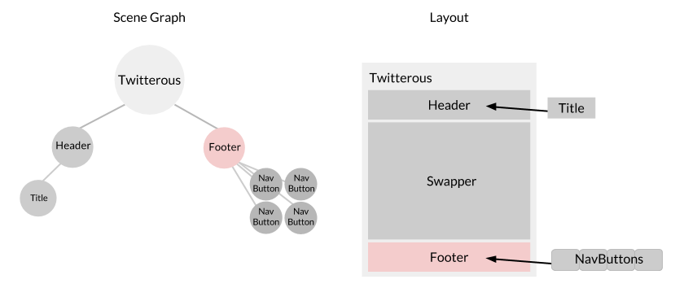

For building out the footer, we will use two classes: `Footer` and `NavButton`. These classes will construct the buttons for navigating the app and the bottom area that will hold them.

In our `Footer` area, we want a button for each section in our app. We can do this easily by building our buttons from the data we import in.  Similar to our `Header`, let's set our `Footer` class up to extend Node.

Open up `Footer.js` and add the following code.
    
    /**
    * Footer.js
    */

    var data = require('./Data');
    var NavButton = require('./NavButton');
    var Node = require('famous/core/Node');

    // the number of sections in the app
    var numSections = data.sections.length;

    // the footer will hold the nav buttons
    function Footer () {
        // subclass Node
        Node.call(this);

        // object to store the buttons
        this.buttons = {};

        // for every section create a NavButton
        // and set its size and align
        data.sections.forEach(function (section, i) {
            this.buttons[section.id] = this.addChild(new NavButton(section.id))
                                           .setProportionalSize(1 / numSections)
                                           .setAlign(i / numSections);
        }.bind(this));
    }

    // subclass Node
    Footer.prototype = Object.create(Node.prototype);

    module.exports = Footer;

<strong>Modified files:</strong> <a href="https://github.com/Famous/lesson-twitterus-starter-kit/blob/step-4/src/twitterus/Footer.js">Footer.js</a>

By importing our data from `Data.json` up top, we can iterate over the `sections` array and create `NavButton` instances for each section. Note how we chain methods from `.addChild()` to size and position each `NavButton` instance.

You should be able to see the parallels between our `Footer` and `Twitterus` classes, especially how we add and position our `NavButtons`. If not, you may want to revisit the [layout](./layout.html) section of this lesson. 

One thing to note here is that we don't create an intermediary node but rather the `Footer` modifies the `NavButtons` directly. This should be considered ok only because we are writing the NavButton class and we know it is the end of the scene graph. 

### NavButton Class

In the code above, we already made calls to our `NavButton` class and passed in our section data. Add the code below to `NavButton.js` to take this data and create uniform buttons.

    // The nav button class will show the name of a section
    // and emit a click event when clicked
    function NavButton (id, status) {
        // Subclass node
        Node.call(this);

        // make and style an element
        this.el = makeEl(this);

        // hold the id of the section
        // this NavButton points to.
        this.id = id;

        // set the content of the element
        // to the target section.
        // initialize the buttons as off
        this.el.setContent(id)
           //note: we will remove this 'default' in the next step
           .addClass('off')
    }

    NavButton.prototype = Object.create(Node.prototype);

    // make and style an element
    function makeEl (node) {
        return new DOMElement(node, {
            properties: {
                textAlign: 'center',
                lineHeight: '100px',
                fontSize: '18px',
                cursor: 'pointer'
            },
            classes: ['navigation']
        });
    };

The buttons above will have either an `'on'` or `'off'` CSS class added to them. In the `index.html` file, these two CSS classes are already styled to make our buttons appear like they are either clicked or not. To toggle between these two classes, let's add the following methods to the `NavButton` class.

    // apply the on class
    NavButton.prototype.on = function on () {
        this.el.removeClass('off').addClass('on');
    };

    // apply the off class
    NavButton.prototype.off = function off () {
        this.el.removeClass('on').addClass('off');
    };

<strong>Modified files:</strong> <a href="https://github.com/Famous/lesson-twitterus-starter-kit/blob/step-4/src/twitterus/NavButton.js">NavButton.js</a>

### Adding it to Twitterus

To use our new `Footer` module, we will follow the same steps we took with our `Header`. Let's begin by importing `Footer` at the top of `Twitterus.js`.

    var Footer = require('./Footer')

Next, add a new `Footer` instance to the function `makeFooter`:

    // make the footer
    function makeFooter (node) {
        // the footer will be aligned
        // to the bottom of its parent.
        // Like the header it will be
        // 100px tall and the complete width.
        // note how we use MountPoint and Align
        // together to line up the bottom of the footer
        // with the bottom of the parent
        node.addChild()
            .setSizeMode('default', 'absolute')
            .setAbsoluteSize(null, 100)
            .setMountPoint(0, 1)
            .setAlign(0, 1)
            .addChild(new Footer());
    }

<strong>Modified files:</strong> <a href="https://github.com/Famous/lesson-twitterus-starter-kit/blob/step-4/src/twitterus/Twitterus.js">Twitterus.js</a>

Before we add `'click'` functionality to the buttons, let's first build our Swapper section. This next section will move a lot more quickly, so make sure you understand [layout](./Layout.html) and the steps above before continuing.

## See your progress

    $ famous deploy

After saving, running the `famous deploy` command in the terminal will update your hosted project and once again return the shareable link and embed code. If you visit the link, you should now see your footer buttons at the bottom of the screen. 

Remove the `.addClass('off')` call in NavButton before moving on to the next step. This will remove the initial CSS styling on the Nav Buttons. Later, we will explain why none of our classes should have an initial state.

<strong>Section recap:</strong> <a href="https://github.com/Famous/lesson-twitterus-starter-kit/tree/step-4">Code for this step</a>

[Up Next: Swapper &raquo;](./Swapper.html)
