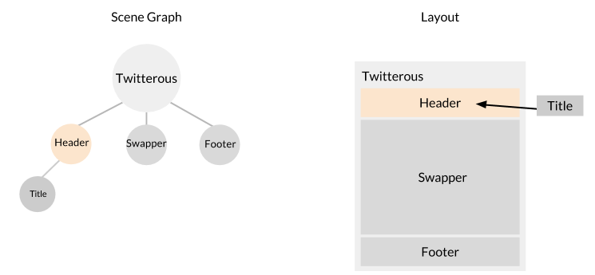

Our header will feature a single title that updates as we swap out sections. To keep our code organized, we will create this header from a `Header` class stored in its own module. 

The `Header` class will be very similar to the `Twitterus` class we just built in the previous steps. First, however, we need to briefly discuss components and then create some data that will populate our app.

### Components

Components are reusable behaviors that can be applied to any node. Twitterus will use two components that are included with the Famous Engine. The first is Align. The align component allows you to set the align property of a node using a transition. It is instantiated by passing the node to the component's constructor.

    var align = new Align(someNode);
    align.set(1, 1, 0, {duration: 1000, curve: 'easeInOut'});

The Align component's `.set()` method will transition the Align values of the node to [1, 1, 0]. It will also use the 'easeInOut' [_easing curve_](../easing-curves.html).

DOMElement is a visible component and, by default, it renders a `
` element. DOMElement components assume the size and position of whatever node they are attached to on instantiation. Create a new DOMElement component by passing a target node to its constructor.

    var el = new DOMElement(targetNode);
    el.setContent('hello world');

This will create a `
` element with the size and position of the `targetNode` and the text 'hello world' in between. The DOMElement also accepts options as its second argument. See [HTML content](../displaying-content.html) and [HTML styling](../styling-content.html) for more detail.

### Section data 

The `Header`, `Footer`, and `Swapper` classes will all need to share data about the app's `Sections`. This data will contain the the section names, number of tweets per section and the initial or current section. Let's create this data in `Data.json` so we can require it throughout our app.

Open up Data.json and add the following lines:
   

    {

       sections: [{
           id: 'Home',
           tweetNumber: 50
       }, {
           id: 'Discover',
           tweetNumber: 50
       }, {
           id: 'Connect',
           tweetNumber: 50
       }, {
           id: 'Me',
           tweetNumber: 25
       }]

    };

Next, let's make 'home' the current section of the app. Add the following lines to `Twitterus` above the child nodes.

    this.currentSection = data.sections[0].id;

We set `this.currentSelection` to the first `id` in our data's `sections` array. Now that we have our data, we can build out the `Header` class. 

<strong>Modified files:</strong> <a href="https://github.com/Famous/lesson-twitterus-starter-kit/blob/step-3/src/twitterus/Twitterus.js">Twitterus.js</a>

### The Header class

Like all of the classes in our app, Header will extend Node. It will also create its own child node to hold and animate the title text. The additional node will let us move the text while keeping the main header background static. 

We'll create an extra child node inside `Header` by calling `.addChild()` on the header node, which we can reference through the `this` keyword. If you're following along, add the lines below to your `Header.js` file.

    var Node = require('famous/core/Node');
    var DOMElement = require('famous/dom-renderables/DOMElement');
    var Align = require('famous/components/Align');

    function Header () {
        Node.call(this);
        this.el = new DOMElement(this, {
            classes: ['header']
        });

        this.title = this.addChild();
        this.titleEl = new DOMElement(this.title).setProperty('textAlign', 'center')
                                                 .setProperty('lineHeight', '100px')
                                                 .setProperty('fontSize', '30px');

        this.titlePosition = new Align(this.title);
    }

    Header.prototype = Object.create(Node.prototype);

    module.exports = Header;

<strong>Modified files:</strong> <a href="https://github.com/Famous/lesson-twitterus-starter-kit/blob/step-3/src/twitterus/Header.js">Header.js</a>

Note how we include two separate HTML Elements for the background and title.

<b>Tip:</b> Similar to HTML, it's a best practice to avoid inline styling in your Famous code. Instead, we recommend adding CSS classes to style your code externally. Above, we show you how to do this by adding the CSS class <code>'header'</code> to the header element. <code>.setProperty()</code> is used on the `titleEl` and elsewhere as a demonstration

### Attaching our header

Let's attach our header to Twitterus. Before calling on the `Header` module, import it at the top of `Twitterus.js` with the following line.

    var Header = require('./Header')

Note: _The `module.exports` line in `Header.js` makes our class accessible as a module through the `require()` statement in `Twitterus.js`. Read up on [Browserify](http://browserify.org/) if you're curious about what's going on under the hood._

In `Twitterus.js`, add a new Header to the 'grandchild' node we created in `makeHeader`.

    function makeHeader(node) {
        node.addChild()
            .setSizeMode('default', 'absolute')
            .setAbsoluteSize(null, 100)
            .addChild(new Header()); //adding the header as 
                                     // 'grandchild' node
    }

<strong>Modified files:</strong> <a href="https://github.com/Famous/lesson-twitterus-starter-kit/blob/step-3/src/twitterus/Twitterus.js">Twitterus.js</a>

## See it live

Since we are working from the famous starter kit, we can deploy this project and see it live on the web! After saving your project, run the following command in your terminal from the root directory:

    $ famous deploy

Navigate to the `Share` link that was output to your terminal to see the beginning of your project hosted by the Famous Cloud services. If you followed the steps correctly, you'll notice a light blue header on dark blue background. Note that the styling for the header and background is taken care of in the starter kit's [index.html](https://github.com/Famous/lesson-twitterus-steps/blob/step6/AddSwapperSectionsTweets/public/index.html) file.

Before we animate the header's title, let's finish creating the rest of our classes inside `Twitterus`.

<strong>Section recap:</strong> <a href="https://github.com/Famous/lesson-twitterus-starter-kit/tree/step-3">Code for this step</a>

[Up Next: Footer &raquo;](./Footer.html)
