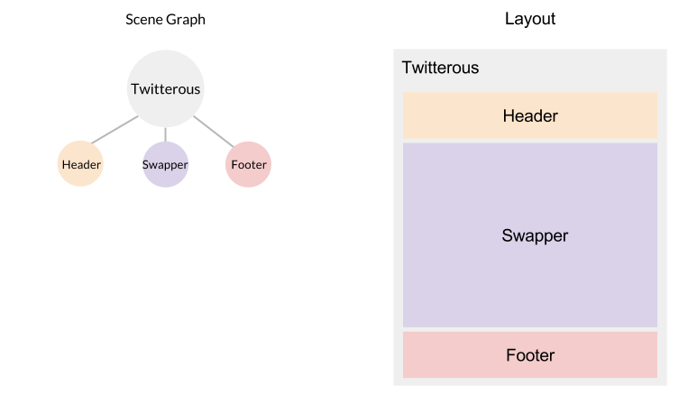

In this section, you'll learn about how nodes interact in the scene graph to position the elements in an app.

In Famous, we do not position elements directly; instead, we position the nodes that _carry_ our elements. We encourage controlling the layout --size, positioning, alignment-- in a 'top down' approach so nodes look up the tree for their own layout. Let's deconstruct the image from the previous slide to visualize how we will do this in Twitterus.

Looking at the image above, you will see that we need three nodes (circles) to carry the elements (rectangles) positioned at top, middle, and bottom of our Twitterus app. We will use three functions that call `addChild()` to create these nodes. These functions will have the following form:

    function makeHeader (node) {
        node.addChild()
            // Some chainable logic
            // positioning the intermediary
            // node
            .addChild();
    }

This function will create a node below the passed in node, set some options on it, then instantiate a new Header (or Footer, etc) as a child of that node. This intermediary node (that will have the options set upon it) is a child of Twitterus. The next element, such as the header, will then be a child of that child (i.e. a grandchild node) and will control the subtree below it.

We call these three functions in the constructor of Twitterus to create the necessary nodes:

    function Twitterus () {
        Node.call(this);

        makeHeader(this);
        makeFooter(this);
        makeSwapper(this);
    }

    // .. complete file not shown .. //

    function makeHeader (node) {
        // Child node extending from Twitterus
        node.addChild()
            // 'Grandchild' node
            .addChild();
    }

    function makeFooter (node) {
        // Child nodes will control layout
        node.addChild()
            // 'Grandchild' nodes will carry 
            // the visible elements e.g. Footer elements 
            .addChild();
    }

    function makeSwapper (node) {
        node.addChild()
            .addChild();
    }

Now that we have three freshly created child nodes extending from Twitterus, let's learn how to position them so they match the layout representation in the diagram above. 

###Layout

Although the Famous layout model may seem daunting at first, it is extremely powerful and flexible once the key concepts are understood. You'll find tasks that are notoriously difficult in CSS a lot easier to control in Famous. First we'll talk about size.

##Size

Before defining the size of a node, you need to tell the node how its size will be calculated. We do this by setting the size 'Mode' of a node for its X, Y and Z values.

A size 'Mode' of `'absolute'` lets you set the node's size in pixels, but if the 'Mode' isn't set, then it defaults to `'relative'` sizing.

    node.setSizeMode('absolute').setAbsoluteSize(1000);

Here, this node will be 1000 pixels wide (X), while its height (Y) and depth (Z) remain undefined. Since we only set the mode and value for X ( `'absolute'` and 1000px ), Y and Z by default inherit their parent's size. 

See the [guides](https://famous.org/learn) for a deeper look at [Sizing](../sizing.html)

##Positioning

There are three concepts in placing nodes. The first is position. Position is simply a pixel value that will position a node relative to its parent.

     node.setPosition(100, 100);

This node will be 100 pixels below and to the right of its parent.

MountPoint is an offset which describes from where on the nodesa linear translation should be applied. So, for example:

     firstNode.setPosition(100, 100).setMountPoint(1, 1);
     secondNode.setPosition(100, 100).setMountPoint(0.5, 0.5);

This means that the first node's bottom right corner will be positioned 100 pixels to the right and below the parent element, while the second node's center will be positioned in the same place. 

Align is a proportional version of position:

     node.setAlign(0.5, 0.5);

This node will be positioned such that its top right corner is exactly in the center of its parent. MountPoint and Align can be combined to neatly describe most layout needs.

     node.setAlign(0.5, 0.5).setMountPoint(0.5, 0.5);

This node will have its center aligned to the center of its parent. Note that Align and MountPoint are automatically responsive to changes in the size of the parent and, in the case where the app is mounted to the body, to the window as well.

See the [guides](http://famous.org/learn) for a deeper look at [positioning](./positioning.html).

###Layout in Twitterus

We will now complete the functions we showed earlier such that the layout is set for our application.

    function makeHeader(node) {
        // The header will be positioned by default
        // along the top of its parent.
        // It will be the complete width of its parent
        // and 100 pixels tall
        node.addChild()
            .setSizeMode('default', 'absolute')
            .setAbsoluteSize(null, 100)
            .addChild();
    }

    function makeSwapper(node) {
        // The swapper will be 200 pixels smaller than
        // its parent in Y and otherwise the same size.
        // It will be position 100 pixels below its parent
        // such that it clears the header
        node.addChild()
            .setDifferentialSize(null, -200)
            .setPosition(0, 100)
            .addChild();
    }

    function makeFooter(node) {
        // The footer will be aligned
        // to the bottom of its parent.
        // Like the header it will be
        // 100px tall and the complete width.
        // Note how we use MountPoint and Align
        // together to line up the bottom of the footer
        // with the bottom of the parent
        node.addChild()
            .setSizeMode('default', 'absolute')
            .setAbsoluteSize(null, 100)
            .setMountPoint(0, 1)
            .setAlign(0, 1)
            .addChild();
    }

<strong>Modified files:</strong> <a href="https://github.com/Famous/lesson-twitterus-starter-kit/blob/step-2/src/twitterus/Twitterus.js">Twitterus.js</a>

Great! Our nodes are now positioned! Read through the inline comments to understand each of the methods called on our nodes. Again, check out our [Platform guides](famous.org/learn) if you need to take a deeper look at [sizing](../sizing.html) or [positioning](./positioning.html). Before moving on, make sure you understand how the functions above create the nodes we expect. 

In the next section, we will create the `Header` class referenced above. 
 

<strong>Section recap:</strong> <a href="https://github.com/Famous/lesson-twitterus-starter-kit/tree/step-2">Code for this step</a>

[Up Next: Header &raquo;](./Header.html)
