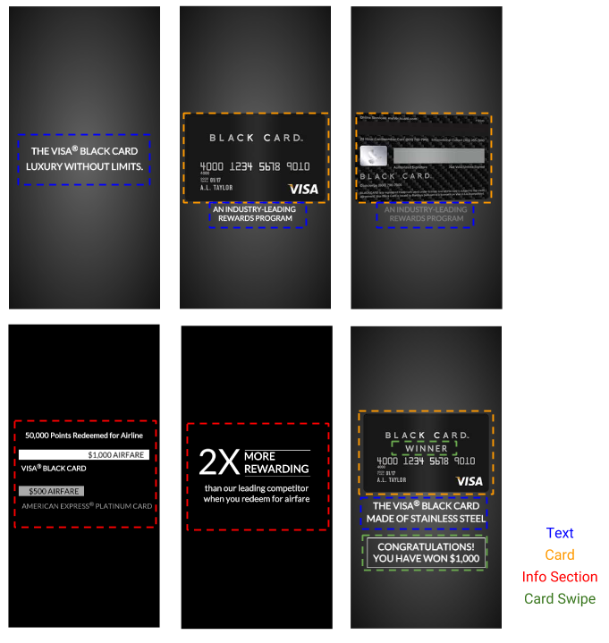

Before we begin coding, let's look at our banner's architecture in terms of its files and its structure. 

###What we're building

When the banner loads, it will start a series of animations spanning a 12 second period. After the intro animations, the banner will then feature a card that can be swiped left or right. On a swipe, another 3 second animation will begin spinning the card and revealing either a _"Winner"_ or _"Apply Now"_ message.

You can view the final version of the project by opening [switch.js](https://github.com/Famous/lesson-visablack-steps/blob/step1/AddTimeline/src/switch.js), commenting out `start/index` and uncommenting `final/index` like we do below.

    
    //module.exports = require('./start/index');
    module.exports = require('./final/index');

If you add the changes above, save and reload [localhost:1337](http://localhost:1337/), you should see the final project animate from start to finish. After checking out what we're goign to build, undo the changes you just made and save once again, so we can start from the beginning. 

###The Files

This lesson will work from the [src/start](https://github.com/Famous/lesson-visablack-steps/tree/master/src/start) folder in the starter kit. It contains the following files:

    index.js
    Timeline.js
    View.js
    VisaAd.js

While we will usually encourage breaking applications into multiple files, most of our code will go into one file: `VisaAd.js`. At the end of the lesson, we will include tips for refactoring your code and breaking it into separate files.

###The Structure

To build this ad, we will organize it into four parts --`Text`, `Card`, `Info Section`, `Card Swipe`-- which we will detail below.

  - `Text:` This will carry most of the banner text that fades in and out throughout the entire intro animation.
  - `Card:` The card will have a front, back, and shimmer. It will spin in and out as the shimmer moves back and forth across the front of the card.
  - `Info Section:` Midway through the intro animation, the Info Section will include two separate animation sequences both featuring an all black background.
  - `Card Swipe:` This will contain the _"Winner"_ and _"Apply Now"_ messages that will randomly reveal/hide after a swipe. This will have its own Timeline and animations that will only run after a swipe. 

We will start by building the `Text`, `Card` and `Info Section` elements and then creating animations for them. Later, we will add the `Card Swipe` elements and link them up to swipe events and a separate timeline.

[Up next: Banner &raquo;](./Banner.html)
