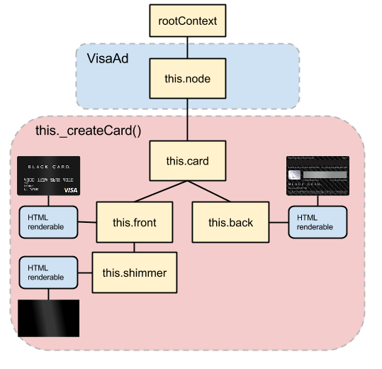

In this section, we will build a card that spins on and off the screen. Since the card will have a front, back and shimmer, we can use the scene graph to animate these elements together as a single unit. 

Similar to the previous step, we will organize all of our Card elements in a single `_createCard()` method and use the View class to create our elements and components. 

###Leveraging the scene graph

To get an idea of how the scene graph works, we've included a diagram below that includes all of the Card elements and how they will link together in our banner. 

_In the diagram, each yellow brick is a new node that we'll create by calling the `addChild()` method on the node above it in the graph._ 

Focus on `this.card` above and you'll notice it has two children (`this.front` and `this.back`) and one grandchild (`this.shimmer`). If we structure our elements in this manner, when we spin the `this.card` node, all elements below it in the graph will follow.  

Let's build the structure above using the following code. You can paste this directly below the `_createBlackCardText()` method in `VisaAd.js`.

    VisaAd.prototype._createCard = function() {

            this.card = new View(this.node.addChild());
            this.card.setAbsoluteSize(259, 163, 0);
            this.card.setOrigin(0.5, 0.5);
            this.card.setAlign(0.5, 0.5);
            this.card.setMountPoint(0.5, 0.5);

            this.front = new View(this.card.addChild());
            this.front.createHTMLElement({
                properties: {
                    backfaceVisibility: 'hidden',
                    '-webkit-backface-visibility': 'hidden',
                    backgroundImage: 'url(./images/visa_front.png)',
                    backgroundSize: 'cover',
                    overflow: 'hidden'
                }
            });
        
            this.front.setAbsoluteSize(259, 163,0);

            this.back = new View(this.card.addChild());
            this.back.createHTMLElement({
                properties: {
                    backfaceVisibility: 'hidden',
                    '-webkit-backface-visibility': 'hidden',
                    backgroundImage: 'url(./images/visa_back.png)',
                    backgroundSize: 'cover',
                    overflow: 'hidden'
                }
            });
            this.back.setRotationY(Math.PI);
            this.back.setPositionZ(10);

            this.shimmer = new View(this.front.addChild());
            this.shimmer.createHTMLElement({
                properties: {
                    background: 'linear-gradient(80deg, rgba(0,0,0,0) 30%,rgba(180,180,180,0.3) 45%,rgba(180,180,180,0.3) 55%, rgba(0,0,0,0) 70%)',
                    zIndex: 10
                }
            });

    }

To create child nodes, the View module lets us call `.addChild()` directly on a View instance. In our code, note how we add `this.shimmer` as a child of `this.front`, so it can move relative to that element. 

Before moving on to the next step, include a call to `this._createCard()` inside the `VisaAd` class. If you save and refresh, your banner should look like the image below:

Now that we have the Text and Card elements attached to our banner, let's create the elements for the Info Section animations.

<strong>Modified file:</strong> <a href="https://github.com/Famous/lesson-visablack-steps/blob/step3/AddCard/src/start/VisaAd.js">VisaAd.js</a>

<strong>Section recap:</strong> <a href="https://github.com/Famous/lesson-visablack-steps/tree/step3/AddCard">Branch for this section</a>

[Up next: Info Section &raquo;](./InfoSection.html)
