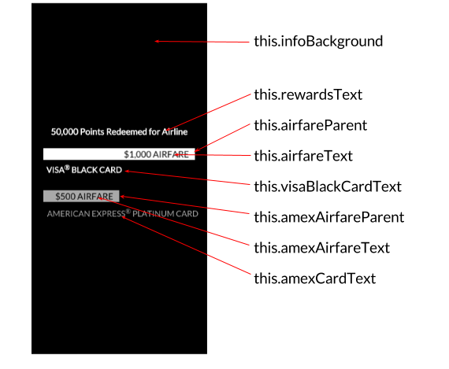
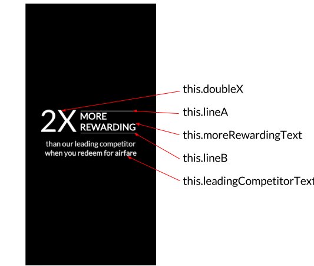

The Info Section will include two mini animations before fading out. These animations will share an all black background and feature several elements moving across the banner. 

Setting the Info Section up will be very similar to the Text and Card sections only with more elements. We will need an HTML renderable and several components for every item pictured below. Here, the View class will be especially handy. 

 

Let's add all of our elements to a `_createInfoSection()` method. 
From there, we will create a view for the black background and then extend all of the Info Section elements from it. 

Add the code below just below the `_createCard()` method from the previous section.

    VisaAd.prototype._createInfoSection = function() {

        this.infoBackground = new View(this.node.addChild());
        this.infoBackground.createHTMLElement({
            properties: {
                background: 'black'
            }
        });
    }

Now let's start building out our `_createInfoSection()` method by adding elements for the first animation sequence.

**Info Section: Part 1**

Note how the elements below correspond to the image above. Let's add this code just below `this.infoBackground` in the `_createInfoSection()` method. 

        this.rewardsText = new View(this.infoBackground.addChild());
        this.rewardsText.createHTMLElement({
            content: '50,000 Points Redeemed for Airline',
            properties: {
                color: 'white',
                textAlign: 'center',
                fontFamily: 'Lato, sans-serif',
                fontSize: '15px',
                fontWeight: '600'
            }
        });
        this.rewardsText.setAlign(0.5, 0.35);
        this.rewardsText.setMountPoint(0.5, 0.0);
        
        //this creates the white bar
        this.airfareParent = new View(this.infoBackground.addChild());
        this.airfareParent.createHTMLElement({
            properties: {
                overflow: 'hidden',
                background: 'rgba(0, 0, 0, 0)'
            }
        });
        this.airfareParent.setAbsoluteSize(260, 20, 0);
        this.airfareParent.setAlign(0.5, 0.43).setMountPoint(0.5, 0.5);

        this.airfareText = new View(this.airfareParent.addChild());
        this.airfareText.createHTMLElement({
            content: '$1,000 AIRFARE',
            properties: {
                background: 'white',
                color: 'black',
                textAlign: 'right',
                fontFamily: 'Lato, sans-serif',
                fontSize: '15px',
                fontWeight: '400',
                paddingRight: '4%',
                paddingTop: '1px',
                boxSizing: 'border-box'
            }
        });

        this.visaBlackCardText = new View(this.infoBackground.addChild());
        this.visaBlackCardText.createHTMLElement({
            content: 'VISA\u00AE BLACK CARD',
            properties: {
                color: 'white',
                textAlign: 'center',
                fontFamily: 'Lato, sans-serif',
                fontSize: '14px',
                fontWeight: '600'
            }
        });
        this.visaBlackCardText.setAlign(0.3, 0.455).setMountPoint(0.5, 0.0);
        
        //this creates the grey bar
        this.amexAirfareParent = new View(this.infoBackground.addChild());
        this.amexAirfareParent.createHTMLElement({
            properties: {
                overflow: 'hidden',
                background: 'rgba(0, 0, 0, 0)'
            }
        });
        this.amexAirfareParent.setAbsoluteSize(260, 20, 0);
        this.amexAirfareParent.setAlign(0.5, 0.55).setMountPoint(0.5, 0.5);

        this.amexAirfareText = new View(this.amexAirfareParent.addChild());
        this.amexAirfareText.createHTMLElement({
            content: '$500 AIRFARE',
            properties: {
                background: 'darkgrey',
                color: 'black',
                textAlign: 'right',
                fontFamily: 'Lato, sans-serif',
                fontSize: '15px',
                fontWeight: '400',
                paddingRight: '4%',
                paddingTop: '1px',
                boxSizing: 'border-box',
            }
        });

        this.amexCardText = new View(this.infoBackground.addChild());
        this.amexCardText.createHTMLElement({
            content: 'AMERICAN EXPRESS\u00AE PLATINUM CARD',
            properties: {
                color: 'darkgrey',
                textAlign: 'center',
                fontFamily: 'Lato, sans-serif',
                fontSize: '14px',
                fontWeight: '500'

            }
        });
        this.amexCardText.setAlign(0.52, 0.58).setMountPoint(0.5, 0.0);

 The code above is self-explainitory, but pay attention to how we build the AIRFARE bars. Rather than setting size on the text elements directly, we add them as child nodes to _parent_ elements. Since child nodes assume the size of their parent, we can leave size undefined in the children, set their background colors, and then delegate their sizes from above.

**Info Section: Part 2**

Similar to the first part, take note of where the pictured elements above appear in the code below. Add this code just below `this.amexCardText` in the `_createInfoSection()` method. 

            this.doubleX = new View(this.infoBackground.addChild());
            this.doubleX.createHTMLElement({
                content: '2X',
                properties: {
                    color: 'white',
                    textAlign: 'center',
                    fontFamily: 'Lato, sans-serif',
                    fontSize: '70px',
                    fontWeight: '200'
                }
            });

            this.doubleX.setAlign(0.25, 0.5).setOrigin(0.5, 0.25).setMountPoint(0.5, 0.5);
            this.doubleX.setAbsoluteSize(150, 150, 0);

            this.moreRewardingText = new View(this.infoBackground.addChild());
            this.moreRewardingText.createHTMLElement({
                content: 'MORE REWARDING',
                properties: {
                    color: 'white',
                    textAlign: 'left',
                    fontFamily: 'Lato, sans-serif',
                    fontSize: '21px',
                    fontWeight: '600'
                }
            });

            this.moreRewardingText.setAlign(0.75, 0.5325).setMountPoint(0.5, 0.5);
            this.moreRewardingText.setAbsoluteSize(200, 150, 0);

            this.lineA = new View(this.infoBackground.addChild());
            this.lineA.createHTMLElement({
                properties: {
                    background: 'white'
                }
            });

            this.lineA.setAlign(0.422, 0.41).setMountPoint(0.0, 0.5);
            this.lineA.setAbsoluteSize(130, 1, 0);

            this.lineB = new View(this.infoBackground.addChild());
            this.lineB.createHTMLElement({
                properties: {
                    background: 'white'
                }
            });

            this.lineB.setAlign(0.422, 0.495).setMountPoint(0.0, 0.5);
            this.lineB.setAbsoluteSize(130, 1, 0);

            this.leadingCompetitorText = new View(this.infoBackground.addChild());
            this.leadingCompetitorText.createHTMLElement({
                content: 'than our leading competitor when you redeem for airfare',
                properties: {
                    color: 'white',
                    textAlign: 'center',
                    fontFamily: 'Lato, sans-serif',
                    fontSize: '17px',
                    fontWeight: '600'
                }
            });

            this.leadingCompetitorText.setAbsoluteSize(250, 100, 0);
            this.leadingCompetitorText.setAlign(0.5, 0.6).setMountPoint(0.5, 0.5);

If you add a call to this method ( `this._createInfoSection()` ) inside `VisaAdd` class, you should now see all of the elements stacked on top of each other like the image below:

Now that we have all of the elements needed for the intro animations, it's time to introduce a Timeline.

<strong>Modified file:</strong> <a href="https://github.com/Famous/lesson-visablack-steps/blob/step4/AddInfoSection/src/start/VisaAd.js">VisaAd.js</a>

<strong>Section recap:</strong> <a href="https://github.com/Famous/lesson-visablack-steps/tree/step4/AddInfoSection">Branch for this section</a>

[Up next: Timeline &raquo;](./Timeline.html)
