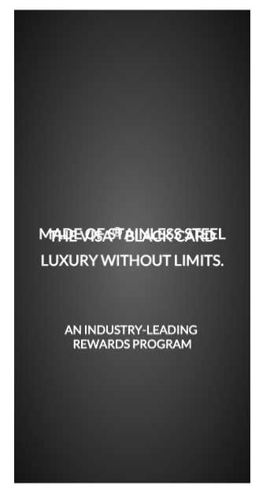

Let's build the Text elements that will appear in the ad. Similar to the previous step, we will use the View module to quickly create renderables and add components to our banner.

We will organize all of the Text elements in a single `_createBlackCardText()` method. In order to introduce the fade in/out and movement animations, each text element will need its own View. Our Text elements will include the following four messages:

  - THE VISA&reg; BLACK CARD
  - LUXURY WITHOUT LIMITS
  - AN INDUSTRY-LEADING  REWARDS PROGRAM
  - MADE OF STAINLESS STEEL

Let's use the View class to create the elements and components for each message above. Open up `VisaAd.js` and add the following code just below the `VisaAd` class. 

 

    VisaAd.prototype._createBlackCardText = function() {
            this.blackCardText = new View(this.node.addChild());
            this.blackCardText.createHTMLElement({
                content: 'THE VISA\u00AE BLACK CARD',
                properties: {
                    color: 'white',
                    fontFamily: 'Lato, sans-serif',
                    fontSize: '20px',
                    fontWeight: '600',
                    textAlign: 'center',
                    zIndex: '-10'
                }
            });

            this.blackCardText.setAlign(0.5, 0.45);
            this.blackCardText.setMountPoint(0.5, 0.0);

            this.blackCardText.setPositionZ(-50);

            this.luxuryText = new View(this.node.addChild());
            this.luxuryText.createHTMLElement({
                content: 'LUXURY WITHOUT LIMITS.',
                properties: {
                    color: 'white',
                    fontFamily: 'Lato, sans-serif',
                    fontSize: '20px',
                    fontWeight: '600',
                    textAlign: 'center',
                    zIndex: '-10'
                }
            });

            this.luxuryText.setAlign(0.5, 0.51);
            this.luxuryText.setMountPoint(0.5, 0.0);
            this.luxuryText.setPositionZ(-50);

            this.industryText = new View(this.node.addChild());
            this.industryText.createHTMLElement({
                content: 'AN INDUSTRY-LEADING  REWARDS PROGRAM',
                properties: {
                    color: 'white',
                    fontFamily: 'Lato, sans-serif',
                    fontSize: '15px',
                    fontWeight: '600',
                    textAlign: 'center',
                    zIndex: '-10'
                }
            });

            this.industryText.setAlign(0.5, 0.66).setMountPoint(0.5, 0.0);

            this.stainlessSteelText = new View(this.node.addChild());
            this.stainlessSteelText.createHTMLElement({
                content: 'MADE OF STAINLESS STEEL',
                properties: {
                    color: 'white',
                    fontFamily: 'Lato, sans-serif',
                    fontSize: '20px',
                    fontWeight: '600',
                    textAlign: 'center',
                    zIndex: '-10'
                }
            });

            this.stainlessSteelText.setAlign(0.5, 0.45);
            this.stainlessSteelText.setMountPoint(0.5, 0.0);

            this.stainlessSteelText.setPositionZ(-50);

    }

Notice how our all of our text elements are direct children of the root node (`this.node`). This is the case because we need to animate each element separately. When we get to our Card and Info Section elements, this will differ slightly.

For now, save and refresh to see all of the Text elements stacked on top of eachother like the image below. 

Until we include our Timeline and begin tweaking initial opacities, all of the elements we add will overlap on the screen. In the meantime, let's ignore the appearance and add the Card elements to our banner.

<strong>Modified file:</strong> <a href="https://github.com/Famous/lesson-visablack-steps/blob/step2/AddText/src/start/VisaAd.js">VisaAd.js</a>

<strong>Section recap:</strong> <a href="https://github.com/Famous/lesson-visablack-steps/tree/step2/AddText">Repo for this section</a>

[Up next: Card &raquo;](./Card.html)
