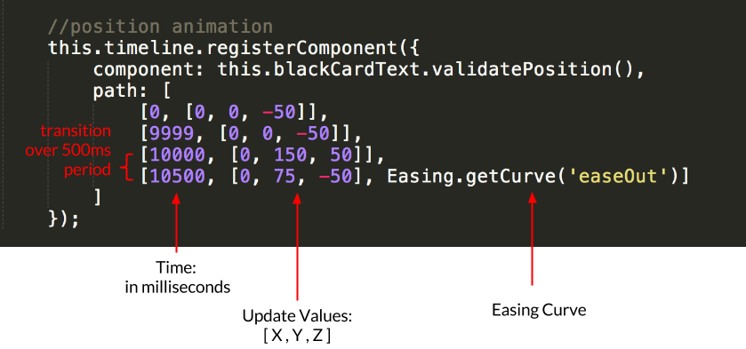

In this section, we will introduce the Timeline module and show you how to lin eup animations. While we won't walk though the entire 12 second intro animation, we will present the first 5 seconds to give you a better understanding of this module. 

### Transitionables
In Famous, we create animations by changing components’ values over time. For instance, if we wanted to move something from left to right across the screen, we would increment the X value of a position component gradually on every frame. We refer to this as _tweening_.

To create _tweens_ in Famous, we use [Transitionables](). Tranitionables simply take beginning values and transition them to ending ones over a period of time. By having Transitionables update our components, we can create smooth, 60fps animations. Timeline uses an inner Transitionable to do just that.

### Timeline

You can think of the Timeline module as a master Transitionable that updates all components passed to it. Let's include a Timeline inside the `VisaAd` class, so we can add our intro animation components to it. 
        
        /*
        * Add this to VisaAd in VisaAd.js
        */

        this.timeline = new Timeline({
          timescale: 1
        });
    

Now, to add and trigger animations, we will use two important methods on our newly created Timeline: `.registerComponent()` and `.set()`. Let's go over them first, before we begin animating.

### .registerComponent()

This method speficifies which component to act on and how to transition that component's values over time.

When calling `.registerComponent()`, we pass it an object with a `component` and a `path`. `component` is the component you wish to reference and `path` is an array of arrays carrying the times, values, and easing curves for each transition. You can think of the items in `path` as _keyframes_. 

 

The image above shows the position animation for `this.blackCardText`. Notice how we use the View's `.validatePosition()` method to reference `this.blackCardText`'s position component. If you were not using a View, you could simply pass any component reference here. 

Focusing on the items in the path array, you'll see all the transition times at the first index position. Transitions will occur at these intervals and act on all the values at the second index position. The path commands above read as follows:
  
  - At 0ms to 9999ms, the Z position will remain at -50px
  - At 9999ms to 10000ms, the  Y position will move from 0px to 150px and Z position from -50px to 50px.
  - At 10000ms to 10500ms, the Y position will move from 150px to 75px and Z position from 50px to -50px. This last transition will span 500ms (10500ms - 10000ms) with an `'easeOut'` [Easing]() curve.

 

###.set()

The Timeline's `.set()` method is responsible for triggering all of our animations. Let's look at this method's parameters below.

    this.timeline.set(12000, {duration: 12000}, callback);
    
    //optional callback
    function callback(){
       console.log('this will run when timeline is complete!') 
    }

The first parameter is the value we will transition to. Behind the scenes, every Timeline creates a Transitionable with an initial value of 0. `set()` gives this inner Transitionable an ending state through its first parameter. 

The second parameter controls duration of the Timeline. 
Since we want our transition values to correspond to time, we will set the duration to 12000ms to match the first parameter. 

The last parameter is an optional callback function. This callback will fire after the `duration` is complete. 

When the JavaScript interpreter reaches the `.set()` method above, it will start the 12000ms timer and in turn update all of the animations that we previously registered. This is why we add the `.set()` method after we define all of our animations. Let's add the animations in the next step below.

### The first five seconds

While we work on the first five seconds, let's comment out the info section and add a call to `_initiateAnimations()` in the VisaAd class. 
    
    this._createBlackCardText();
    this._createCard();
    //this._createInfoSection();
    this._initiateAnimations();

The `_initateAnimations()` method below will eventually hold all of our intro animations. Read through the inline comments below before adding this code to `VisaAd.js`. This will add the first animation sequence.

    VisaAd.prototype._initiateAnimations = function() {
         
    /********** Black Card Text Animations **********/

        //opacity animation
        this.timeline.registerComponent({
            component: this.blackCardText.validateOpacity(),
            path: [
                [0, 0],    //at 0ms start fade in
                [750, 1],  //at 750ms end fade in
                [3000, 1], //at 3000ms start fade out
                [3500, 0]  //at 3500ms end fade out
            ]
        });

        //position animation
        this.timeline.registerComponent({
            component: this.blackCardText.validatePosition(),
            path: [
                [0, [0, 0, -50]] //start -50 z-index. Will go behind the card
            ]
        });
        
    /********** Stainless Steel Text Animations **********/
            
        //opacity animation
        this.timeline.registerComponent({
            component: this.stainlessSteelText.validateOpacity(),
            path: [
                [0, 0] //start faded out
            ]
        });
        
        //position animation
        this.timeline.registerComponent({
            component: this.stainlessSteelText.validatePosition(),
            path: [
                [0, [0, 0, -50]] //start behind everything
            ]
        });

    /********** Luxury Text Animations **********/
        
        //opacity animation
        this.timeline.registerComponent({
            component: this.luxuryText.validateOpacity(),
            path: [
                [0, 0],    //start faded out
                [750, 0],  //at 750ms start fade in
                [1500, 1], //at 1500ms end fade in
                [3000, 1], //at 3000ms start fading out
                [3500, 0]  //at 3500ms end fade out
            ]
        });

    /********** Industry Text Animations **********/
        
        //position animation
        this.timeline.registerComponent({
            component: this.industryText.validatePosition(),
            path: [
                [0, [0, 0, 100]],   //start at Z index 100
                [3100, [0, 0, 100]], //at 3100ms start moving behind
                [3500, [0, 0, -20], Easing.getCurve('easeOut')] // ease to -20 Z index
            ]
        });
        
        //opacity animation
        this.timeline.registerComponent({
            component: this.industryText.validateOpacity(),
            path: [
                [0, 0],    //start faded out
                [3100, 0], //at 3100ms start fade in
                [3400, 1], //at 3400ms end fade in
                [4300, 1], //at 4300 start fade out
                [4800, 0]  //at 4800 end fade out 
            ]
        });
        
    /********** Card Front Animations **********/
        
        //opacity animation
        this.timeline.registerComponent({
            component: this.front.validateOpacity(),
            path: [
              [0, 1],    //start faded in
              [5000, 1], //at 5000ms start fading out
              [5300, 0]  //at 5300ms end fade out
            ]   
        });
    /********** Card Shimmer Animations **********/
        
        //position animation
        this.timeline.registerComponent({
            component: this.shimmer.validatePosition(),
            path: [
                [0, [-259, 0, 0]],    //at 0ms start at far left X axis (-259px)
                [2700, [-259, 0, 0]], //at 2700ms start moving to right of card
                [3400, [259, 0, 0]],  //at 3400ms end moving at 259 px over in X
                [3800, [259, 0, 0]],  //at 3800ms start moving back to left
                [4300, [-259, 0, 0]], //at 4300ms end moving to left
                [4301, [259, 0, 0]],  //at 4301ms start moving back right
                [4600, [259, 0, 0]],  //at 4600ms start moving back left
                [5300, [-259, 0, 0]], //at 5300ms end moving back left
        ]});

    /**********  Card Animations **********/
        
        //position animation
        this.timeline.registerComponent({
            component : this.card.validatePosition(),
            path : [
                [0, [-300, 0, 1000]], //start at -300px Xpos and 1000 in Zpos
                [1500, [-300, 0, 1000]], //at 1500ms start moving center and 50 in Zpos
                [2900, [0, 0, 50], Easing.getCurve('easeOut')], //at 2900ms center on banner in front
                [4700, [0, 0, 50]], //at 4700ms start increasing Z position
                [5200, [0, 0, 500], Easing.getCurve('easeIn')], //at 5200 finish Z movement with ease
            ]
        });
        
        //rotation animation
        this.timeline.registerComponent({
            component : this.card.validateRotation(),
            path : [
                [0, [0, Math.PI * -1, 0]], //start rotated out
                [1500, [0, Math.PI * -1, 0]], //at 1500ms start rotating in
                [2800, [0, 0.5, 0], Easing.getCurve('easeOut')], //at 2800ms end .5 rotation with ease
                [3000, [0, 0, 0], Easing.getCurve('easeIn')], // at 3000ms ease to 0 rotation
                [3800, [0, 0, 0]], // at 3800ms start rotation
                [4500, [0, Math.PI, 0], Easing.getCurve('easeInOut')], //at 4500ms end rotation
                [4550, [0, Math.PI, 0]], //at 4550ms start rotation
                [5100, [0, Math.PI * 2, 0], Easing.getCurve('easeInOut')], //at 5100ms end rotation
            ]
        });

       /*** this will run all of our Timeline animations over a 12 second period ***/
        this.timeline.set(12000, {duration: 12000});
       
    }

Try changing the values at each keyframe above and see how it affects the output. Notice how we add the call to `.set()` after we define all of our animations. Later, when we add the card swipe interaction, we will initiate our next Timeline through a callback passed to set. 

Once you are done playing with this file, you can add the rest of the 12 second intro animations found [here](https://github.com/Famous/lesson-visablack-steps/blob/step6/AddAllAnimations/src/start/VisaAd.js).

<strong>Modified file:</strong> <a href="https://github.com/Famous/lesson-visablack-steps/blob/step5/AddFirstFiveSeconds/src/start/VisaAd.js">VisaAd.js</a>

<strong>Section recap:</strong> <a href="https://github.com/Famous/lesson-visablack-steps/tree/step4/AddInfoSection">Branch for this section</a>

[Up next: User Interaction &raquo;](./UserInteraction.html)
